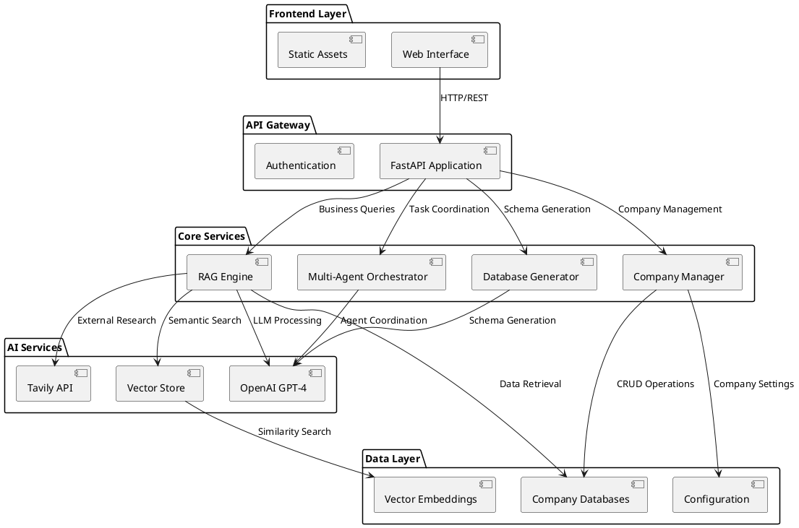
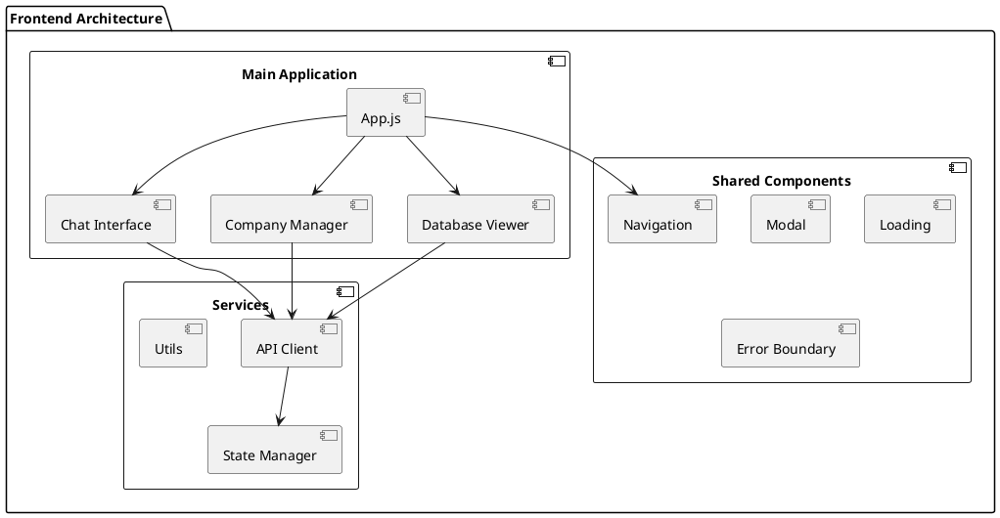
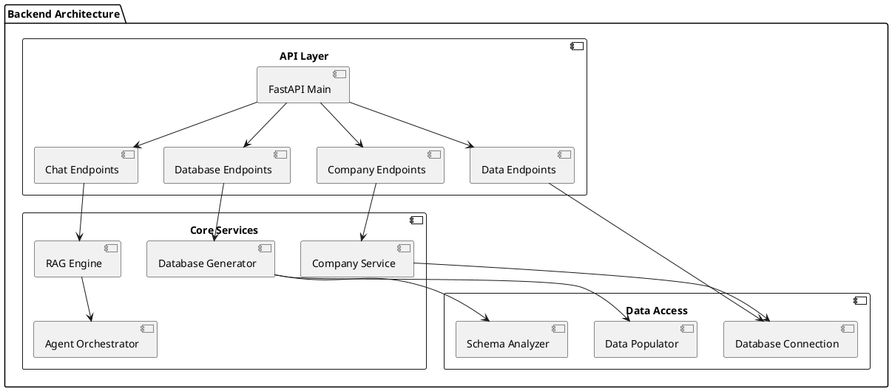
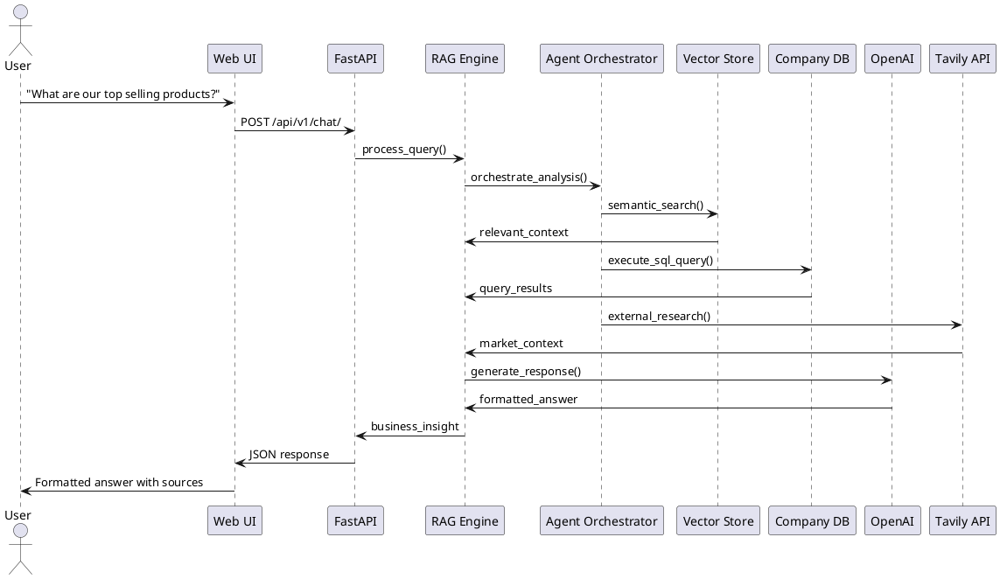
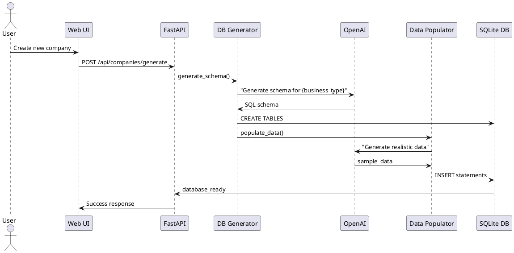
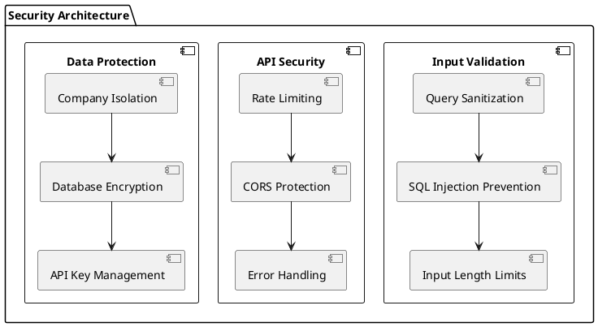
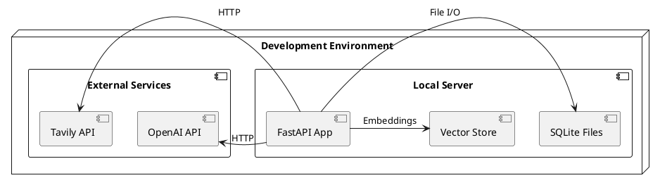

# Architecture Document
# AI-Powered Business Intelligence Platform

**Document Version:** 1.0  
**Date:** October 3, 2025  
**System:** AI-Powered Business Intelligence Platform  
**Architects:** AI-Generated with Human Oversight

## 1. System Overview

### 1.1 Architecture Vision
The AI-Powered Business Intelligence Platform is designed as a microservices-based system that combines AI database generation, RAG-powered analytics, and multi-agent coordination to provide intelligent business insights through natural language interfaces.

### 1.2 High-Level Architecture

## 2. Component Architecture

### 2.1 Frontend Components

### 2.2 Backend Services Architecture

## 3. Data Flow Architecture

### 3.1 Business Intelligence Query Flow

### 3.2 Database Generation Flow

## 4. Technology Stack

### 4.1 Core Technologies
- **Backend Framework:** FastAPI (Python 3.13+)
- **Database:** SQLite with dynamic schema generation
- **AI Services:** OpenAI GPT-4, Tavily API
- **Vector Store:** ChromaDB
- **Frontend:** Vanilla JavaScript with Glassmorphism design
- **Architecture:** REST API with multi-agent coordination

### 4.2 Development Tools
- **Version Control:** Git with GitHub
- **Testing:** pytest for backend, manual testing for frontend
- **Documentation:** Markdown with PlantUML diagrams
- **Deployment:** Uvicorn ASGI server

## 5. Security Architecture

### 5.1 Security Layers

## 6. Scalability Considerations

### 6.1 Current Architecture Scalability
- **Horizontal Scaling:** FastAPI supports multiple workers
- **Database Scaling:** Individual SQLite files per company
- **AI Service Scaling:** External API calls with rate limiting
- **Vector Store Scaling:** ChromaDB with persistent storage

### 6.2 Future Enhancements
- **Microservices:** Split into individual services
- **Database Migration:** PostgreSQL for multi-tenancy
- **Caching Layer:** Redis for query caching
- **Load Balancing:** Multiple API instances

## 7. Monitoring and Observability

### 7.1 Logging Strategy
- **Application Logs:** FastAPI request/response logging
- **Error Tracking:** Comprehensive exception handling
- **Performance Metrics:** Response time tracking
- **AI Usage Metrics:** Token consumption monitoring

## 8. Deployment Architecture

### 8.1 Development Deployment

## 9. Decision Rationale

### 9.1 Key Architectural Decisions
See Architecture Decision Records (ADRs) for detailed justifications:
- **ADR-001:** FastAPI Framework Selection
- **ADR-002:** SQLite Database Architecture  
- **ADR-003:** OpenAI Multi-Agent RAG Architecture
- **ADR-004:** Glassmorphism Frontend with Vanilla JS

## 10. Future Architecture Evolution

### 10.1 Planned Enhancements
- **Real-time Analytics:** WebSocket integration for live data
- **Advanced AI Agents:** Specialized agents for different business domains
- **Multi-Modal Support:** Support for document upload and image analysis
- **Enterprise Features:** Role-based access control and audit logging

---

**Document Status:** Complete  
**Next Review:** TBD  
**Approval:** Pending stakeholder review